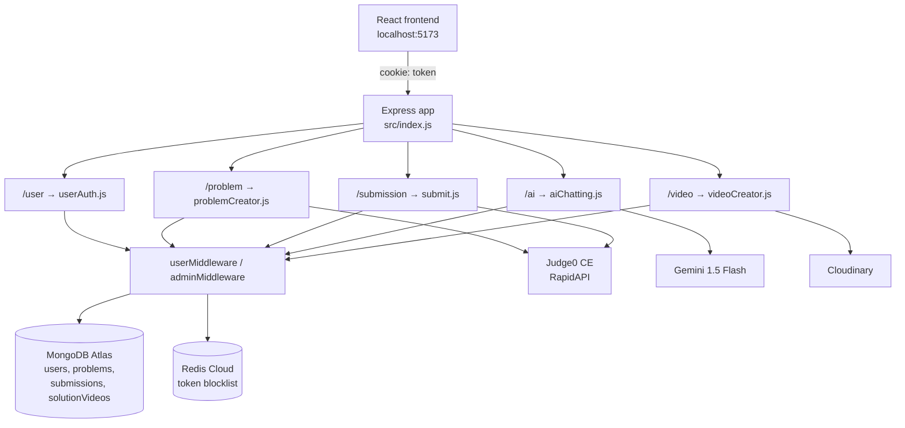
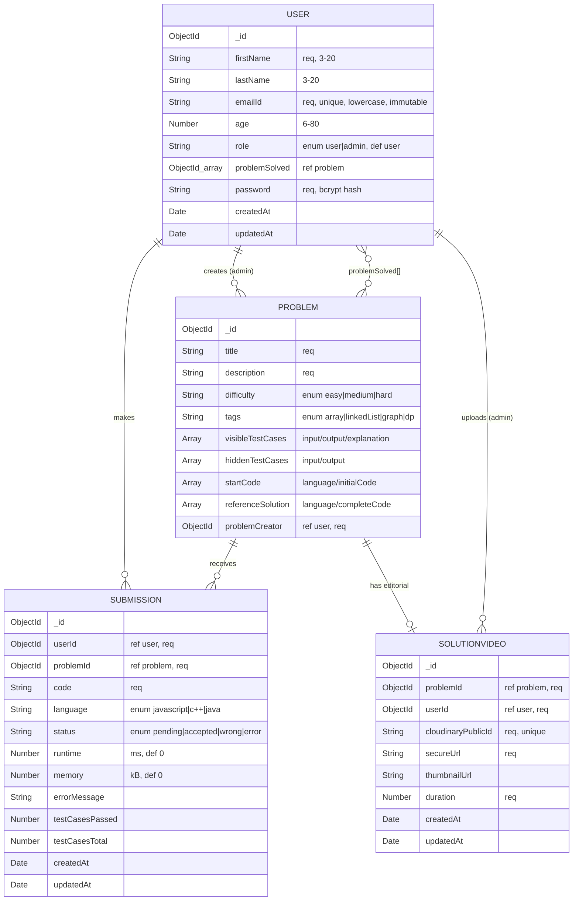
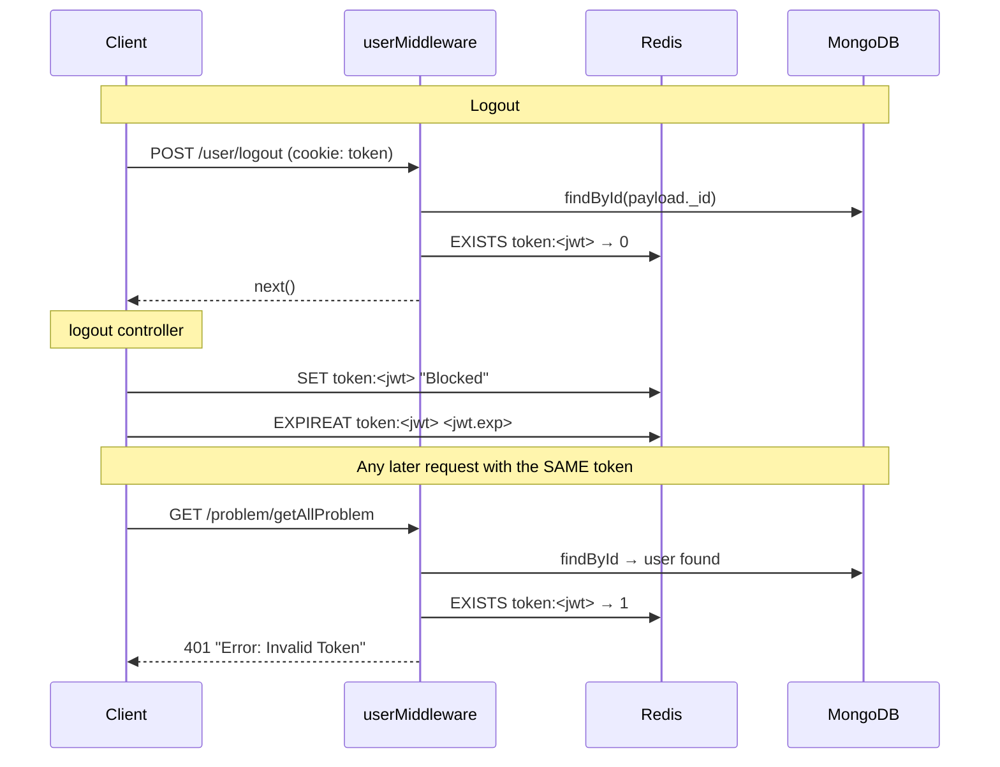
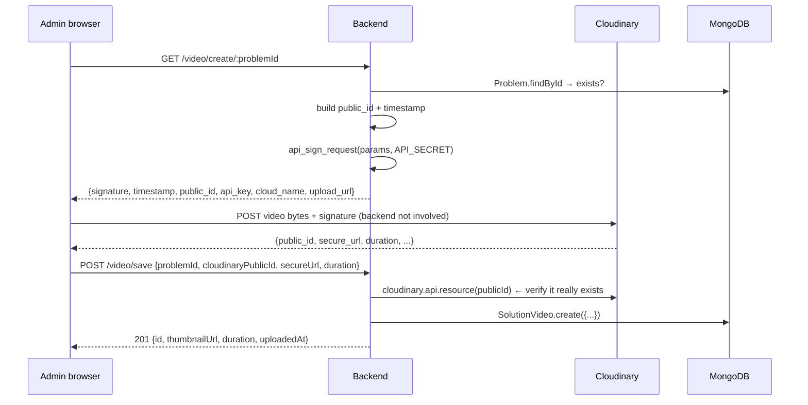
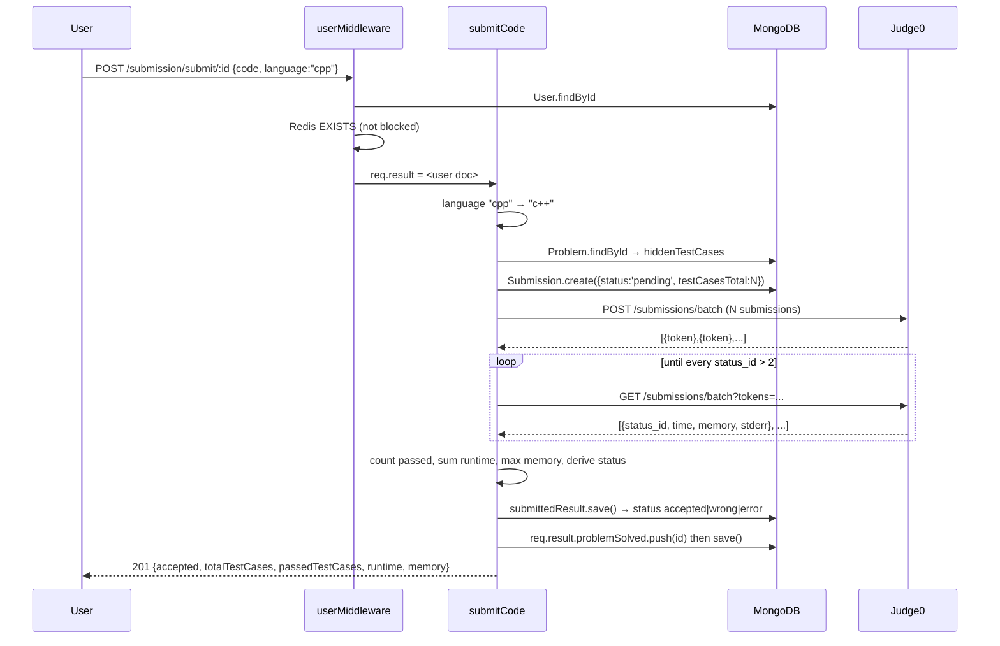

# Backend — Complete Technical Walkthrough

A file-by-file, line-by-line explanation of the LeetCode-clone backend, its two databases, and every external service it talks to.

**Root:** `FinalProject/14Dev/backend/`

---

## Table of Contents

1. [Bird's-eye view](#1-birds-eye-view)
2. [Tech stack & dependencies](#2-tech-stack--dependencies)
3. [Directory map](#3-directory-map)
4. [Boot sequence — `src/index.js`](#4-boot-sequence--srcindexjs)
5. [Config layer — the two database connections](#5-config-layer--the-two-database-connections)
6. [Database deep-dive: MongoDB](#6-database-deep-dive-mongodb)
7. [Database deep-dive: Redis](#7-database-deep-dive-redis)
8. [Utilities — `validator.js` and `problemUtility.js`](#8-utilities)
9. [Middleware — the auth gates](#9-middleware--the-auth-gates)
10. [Controllers — every function explained](#10-controllers)
11. [Routes — the complete API surface](#11-routes--the-complete-api-surface)
12. [End-to-end request walkthroughs](#12-end-to-end-request-walkthroughs)
13. [Environment variables](#13-environment-variables)
14. [Running the backend](#14-running-the-backend)
15. [Bugs, gaps and security notes](#15-bugs-gaps-and-security-notes)

---

## 1. Bird's-eye view

The backend is a **stateless Express 5 REST API** that does five jobs:

| Job | Powered by |
|---|---|
| Store users, problems, submissions, videos | **MongoDB** (via Mongoose) |
| Log users in / out, revoke tokens | **JWT cookies + Redis blocklist** |
| Actually *run* user-submitted code | **Judge0 CE** (RapidAPI) |
| Answer "help me with this problem" chat | **Google Gemini** (`@google/genai`) |
| Host editorial solution videos | **Cloudinary** (signed direct upload) |

There is no session store and no server-side rendering. The only server state that lives outside MongoDB is the Redis token blocklist.



---

## 2. Tech stack & dependencies

From `backend/package.json`:

```json
"type": "commonjs"
```

Everything uses `require()` / `module.exports` — **not** ESM. (The frontend is the opposite: `"type": "module"`.)

| Package | Version | What it's used for here |
|---|---|---|
| `express` | ^5.1.0 | HTTP server & router. v5 auto-catches async errors differently than v4 — see [§15](#15-bugs-gaps-and-security-notes). |
| `mongoose` | ^8.14.0 | MongoDB ODM — schemas, validation, populate, middleware hooks. |
| `redis` | ^5.0.0 | Node Redis client, used *only* as a JWT blocklist. |
| `jsonwebtoken` | ^9.0.2 | Signs & verifies the auth token. |
| `bcrypt` | ^5.1.1 | Password hashing (10 salt rounds). |
| `cookie-parser` | ^1.4.7 | Parses `Cookie:` header into `req.cookies`. |
| `cors` | ^2.8.5 | Allows the Vite dev origin with credentials. |
| `dotenv` | ^16.5.0 | Loads `.env` into `process.env`. |
| `validator` | ^13.15.0 | Email & password-strength checks at registration. |
| `axios` | ^1.9.0 | HTTP client for Judge0. |
| `@google/genai` | ^1.3.0 | Gemini SDK for the AI tutor. |
| `cloudinary` | ^2.6.1 | Signed upload params + resource lookup + delete. |

> There is **no** `nodemon`, **no** `start` script, and **no** test runner. `npm test` is the default `exit 1` stub. You start the server with `node src/index.js`.

---

## 3. Directory map

```
backend/
├── .env                     # secrets (9 vars) — NOT gitignored, see §13
├── package.json
├── package-lock.json
└── src/
    ├── index.js             # entry point: middleware, route mounting, boot
    ├── config/
    │   ├── db.js            # Mongoose connection
    │   └── redis.js         # Redis client (host hardcoded)
    ├── models/              # 4 Mongoose schemas
    │   ├── user.js
    │   ├── problem.js
    │   ├── submission.js
    │   └── solutionVideo.js
    ├── middleware/
    │   ├── userMiddleware.js    # any logged-in user
    │   └── adminMiddleware.js   # logged-in AND role === 'admin'
    ├── routes/              # 5 Express routers, one per domain
    │   ├── userAuth.js
    │   ├── problemCreator.js
    │   ├── submit.js
    │   ├── aiChatting.js
    │   └── videoCreator.js
    ├── controllers/         # the actual handlers
    │   ├── userAuthent.js       # register/login/logout/adminRegister/deleteProfile
    │   ├── userProblem.js       # problem CRUD + user progress
    │   ├── userSubmission.js    # run & submit code
    │   ├── solveDoubt.js        # Gemini chat
    │   └── videoSection.js      # Cloudinary signature/save/delete
    └── utils/
        ├── validator.js         # registration field validation
        └── problemUtility.js    # Judge0 client
```

The layering is a textbook **route → middleware → controller → model** chain. Utilities sit beside controllers; there is no service layer.

---

## 4. Boot sequence — `src/index.js`

```js
const express = require('express')
const app = express();
require('dotenv').config();
```

**Line 3 matters a lot.** `dotenv.config()` runs *before* the `require` calls below it. Since `config/redis.js` reads `process.env.REDIS_PASS` **at module load time** (not inside a function), the env must already be populated when that file is required. Move `dotenv` below those requires and Redis auth silently breaks.

```js
const main         = require('./config/db')
const cookieParser = require('cookie-parser');
const authRouter    = require("./routes/userAuth");
const redisClient   = require('./config/redis');
const problemRouter = require("./routes/problemCreator");
const submitRouter  = require("./routes/submit")
const aiRouter      = require("./routes/aiChatting")
const videoRouter   = require("./routes/videoCreator");
const cors = require('cors')
```

### Global middleware (order is significant)

```js
app.use(cors({
    origin: 'http://localhost:5173',
    credentials: true
}))

app.use(express.json());
app.use(cookieParser());
```

1. **`cors`** — hardcoded to the Vite dev server. `credentials: true` is mandatory here because auth is cookie-based; without it the browser refuses to attach the `token` cookie to cross-origin XHR. The frontend must correspondingly send `withCredentials: true` (it does, in `frontend/src/utils/axiosClient.js`).
2. **`express.json()`** — parses `application/json` bodies into `req.body`. Every controller assumes this ran.
3. **`cookieParser()`** — populates `req.cookies.token`, which both middlewares read.

There is **no** `express.urlencoded`, **no** rate limiter, **no** helmet, and **no** request logger.

### Route mounting

```js
app.use('/user',       authRouter);
app.use('/problem',    problemRouter);
app.use('/submission', submitRouter);
app.use('/ai',         aiRouter);
app.use("/video",      videoRouter);
```

These five prefixes are the entire public surface. Note there is **no 404 handler** and **no error-handling middleware** (`(err, req, res, next)`), so anything that escapes a controller's `try/catch` falls through to Express's default handler.

### Startup

```js
const InitalizeConnection = async ()=>{
    try{
        await Promise.all([main(), redisClient.connect()]);
        console.log("DB Connected");

        app.listen(process.env.PORT, ()=>{
            console.log("Server listening at port number: "+ process.env.PORT);
        })
    }
    catch(err){
        console.log("Error: "+err);
    }
}

InitalizeConnection();
```

The design decision here: **the server does not bind a port until both databases are up.** `Promise.all` runs the Mongo connect and Redis connect concurrently and rejects if either fails. On failure it logs and the process simply exits (no retry, no `process.exit(1)`), which means a failed boot looks like a silently dead process.

---

## 5. Config layer — the two database connections

### `src/config/db.js`

```js
const mongoose = require('mongoose');

async function main() {
    await mongoose.connect(process.env.DB_CONNECT_STRING)
}

module.exports = main;
```

Minimal on purpose. Mongoose 8 no longer needs `useNewUrlParser`/`useUnifiedTopology` — those are defaults. The connection string (`DB_CONNECT_STRING`) is an Atlas SRV URI including the database name.

Once this resolves, **every** `mongoose.model(...)` registered anywhere in the app shares this single global connection pool. That is why the models never import the connection — Mongoose keeps it on a module-level singleton.

### `src/config/redis.js`

```js
const { createClient } = require('redis');

const redisClient = createClient({
    username: 'default',
    password: process.env.REDIS_PASS,
    socket: {
        host: 'redis-19934.c212.ap-south-1-1.ec2.redns.redis-cloud.com',
        port: 19934
    }
});

module.exports = redisClient;
```

- Points at a **Redis Cloud** instance in `ap-south-1`.
- `username: 'default'` + password is Redis 6 ACL auth.
- The client is created at import but **not connected** — `index.js` calls `redisClient.connect()`.
- **The host and port are hardcoded**, so moving environments requires a code change, not a config change. Only the password is externalised.

---

## 6. Database deep-dive: MongoDB

Four collections. Mongoose pluralises model names, so the actual MongoDB collections are `users`, `problems`, `submissions`, `solutionvideos`.



---

### 6.1 `models/user.js`

```js
const userSchema = new Schema({
    firstName: { type: String, required: true, minLength: 3, maxLength: 20 },
    lastName:  { type: String, minLength: 3, maxLength: 20 },
    emailId:   { type: String, required: true, unique: true,
                 trim: true, lowercase: true, immutable: true },
    age:       { type: Number, min: 6, max: 80 },
    role:      { type: String, enum: ['user','admin'], default: 'user' },
    problemSolved: {
        type: [{ type: Schema.Types.ObjectId, ref: 'problem', unique: true }],
    },
    password:  { type: String, required: true }
}, { timestamps: true });
```

Field-by-field:

- **`firstName`** — required, 3–20 chars. Note `minLength: 3` means "Al" or "Bo" is rejected.
- **`lastName`** — optional, but *if provided* must be 3–20 chars.
- **`emailId`** — the login identifier.
  - `unique: true` builds a **unique index** — this is an index directive, not a validator, so a duplicate email surfaces as a MongoDB `E11000` error, not a Mongoose `ValidationError`. It gets caught and returned as a 400 with the raw error string.
  - `trim` + `lowercase` are **setters**: they normalise on write, so `"  Bob@X.COM "` is stored as `bob@x.com`. This is what makes `User.findOne({emailId})` at login work reliably — but only because the login lookup value comes from a body that is *also* lowercase... which it is **not** normalised on read. See [§15](#15-bugs-gaps-and-security-notes).
  - `immutable: true` — Mongoose silently ignores any attempt to change it after creation.
- **`age`** — never set by any controller; present but unused.
- **`role`** — the entire authorization model. `enum` restricts to `'user'`/`'admin'`; `default: 'user'` means anything that forgets to set it gets the safe value.
- **`problemSolved`** — an array of `ObjectId`s referencing `problem`. This is a **denormalised many-to-many**: instead of a join collection, the solved list lives on the user document. `ref: 'problem'` is what lets `.populate('problemSolved')` work in `solvedAllProblembyUser`.
  - ⚠️ The `unique: true` on the array *element* does not mean "no duplicates within one user's array" — Mongoose translates it into a unique index on the `problemSolved` **path**, which in MongoDB's multikey-index semantics means *no two user documents may share a solved problem*. That is almost certainly not the intent. The dedupe that actually works is the explicit `.includes()` check in `submitCode`.
- **`password`** — stores the **bcrypt hash**, never plaintext. There is no `select: false`, so `User.findById()` returns the hash on every authenticated request (both middlewares do exactly this, then attach the whole document to `req.result`).

**`timestamps: true`** adds `createdAt` / `updatedAt` automatically.

#### The cascade-delete hook

```js
userSchema.post('findOneAndDelete', async function (userInfo) {
    if (userInfo) {
      await mongoose.model('submission').deleteMany({ userId: userInfo._id });
    }
});
```

A **post-hook on query middleware**. When a user document is deleted via `findOneAndDelete` — and, importantly, via `findByIdAndDelete`, which Mongoose implements *as* `findOneAndDelete` — this fires with the deleted document and wipes that user's submissions. This is why `deleteProfile` in the controller can leave its manual `Submission.deleteMany` commented out and still be correct.

Note the model is fetched with `mongoose.model('submission')` rather than `require('../models/submission')` — that avoids a circular-import problem between the two model files.

⚠️ The hook does **not** clean up `problems` created by an admin, nor `solutionVideos` they uploaded — those become orphaned rows with a dangling `problemCreator` / `userId`.

---

### 6.2 `models/problem.js`

```js
const problemSchema = new Schema({
    title:       { type: String, required: true },
    description: { type: String, required: true },
    difficulty:  { type: String, enum: ['easy','medium','hard'], required: true },
    tags:        { type: String, enum: ['array','linkedList','graph','dp'], required: true },
    ...
})
```

- **`difficulty`** — drives the coloured badge on the frontend problem list.
- **`tags`** — despite the plural name, this is a **single string**, not an array. A problem can carry exactly one of four categories. Widening it to `[String]` would be the natural fix, but the frontend filter dropdown currently assumes a scalar.

#### The four sub-document arrays

```js
visibleTestCases: [{ input: String*, output: String*, explanation: String* }],
hiddenTestCases:  [{ input: String*, output: String* }],
startCode:        [{ language: String*, initialCode: String* }],
referenceSolution:[{ language: String*, completeCode: String* }],
```
*(all fields `required: true`)*

This split is the core of the grading model:

| Array | Who sees it | What it's for |
|---|---|---|
| `visibleTestCases` | Everyone | Shown as "Examples" on the problem page; used by **Run** (`runCode`); used to *validate the reference solution* at problem-creation time. |
| `hiddenTestCases` | Server only | Used by **Submit** (`submitCode`). This is what determines Accepted/Wrong. Never sent to the client — `getProblemById`'s `.select()` deliberately omits it. |
| `startCode` | Everyone | Boilerplate loaded into the Monaco editor per language. |
| `referenceSolution` | Should be server-only | Admin's known-good solution, executed against `visibleTestCases` on create/update to prove the test data is correct. ⚠️ It **is** currently returned to clients — see [§15](#15-bugs-gaps-and-security-notes). |

`input` and `output` are stored as **strings** because that is literally what Judge0 wants: `stdin` and `expected_output`.

```js
problemCreator: { type: Schema.Types.ObjectId, ref: 'user', required: true }
```

Audit trail of which admin authored the problem. Set server-side in `createProblem` from `req.result._id`, never from the request body — even though the body destructures a `problemCreator` field, that value is discarded.

**No `timestamps: true` on this schema** — problems have no `createdAt`. That is an inconsistency with the other three models.

---

### 6.3 `models/submission.js`

```js
const submissionSchema = new Schema({
  userId:    { type: Schema.Types.ObjectId, ref: 'user',    required: true },
  problemId: { type: Schema.Types.ObjectId, ref: 'problem', required: true },
  code:      { type: String, required: true },
  language:  { type: String, required: true, enum: ['javascript','c++','java'] },
  status:    { type: String, enum: ['pending','accepted','wrong','error'], default: 'pending' },
  runtime:   { type: Number, default: 0 },   // milliseconds
  memory:    { type: Number, default: 0 },   // kB
  errorMessage:    { type: String, default: '' },
  testCasesPassed: { type: Number, default: 0 },
  testCasesTotal:  { type: Number, default: 0 }
}, { timestamps: true });

submissionSchema.index({ userId: 1, problemId: 1 });
```

This is the **immutable-ish audit log** of every graded attempt. Key points:

- **`language` enum uses `'c++'`, not `'cpp'`.** The frontend/Monaco sends `cpp`. Both `submitCode` and `runCode` therefore contain an explicit normalisation line:
  ```js
  if (language === 'cpp') language = 'c++'
  ```
  Forget that line and `Submission.create` throws a `ValidationError`.

- **`status` lifecycle:** the document is created as `'pending'` *before* Judge0 is called, then patched to `accepted` / `wrong` / `error` after results come back. This ordering matters — if Judge0 times out or the process dies mid-request, you still have a `pending` row proving the attempt happened, rather than losing it entirely.

- **`runtime`** — the controller *sums* the per-testcase times (Judge0 returns seconds as a string, e.g. `'0.002'`). The field comment says milliseconds; the stored value is actually a sum of seconds. See [§15](#15-bugs-gaps-and-security-notes).

- **`memory`** — `Math.max` across passing test cases. Judge0 reports kB, matching the comment.

- **`testCasesPassed` / `testCasesTotal`** — powers the "12/15 passed" display. `testCasesTotal` is set at creation from `problem.hiddenTestCases.length`.

#### The compound index

```js
submissionSchema.index({ userId: 1, problemId: 1 });
```

A **non-unique compound index** — a user may submit the same problem many times, which is the point. It exists to make the one hot query fast:

```js
Submission.find({ userId, problemId })   // in submittedProblem
```

Because the index is `(userId, problemId)` in that order, it also serves `find({ userId })` alone (index prefix rule), but **not** `find({ problemId })` alone.

---

### 6.4 `models/solutionVideo.js`

```js
const videoSchema = new Schema({
    problemId:          { type: Schema.Types.ObjectId, ref: 'problem', required: true },
    userId:             { type: Schema.Types.ObjectId, ref: 'user',    required: true },
    cloudinaryPublicId: { type: String, required: true, unique: true },
    secureUrl:          { type: String, required: true },
    thumbnailUrl:       { type: String },
    duration:           { type: Number, required: true },
}, { timestamps: true });
```

Metadata only — **the video bytes never touch this server**. The browser uploads straight to Cloudinary using a signature this backend generates; afterwards the frontend calls back with the resulting IDs and this row is written.

- **`cloudinaryPublicId`** — the join key back to Cloudinary. `unique: true` prevents registering the same asset twice, and is what makes `deleteVideo`'s `cloudinary.uploader.destroy()` unambiguous.
- **`secureUrl`** — the `https://` playback URL, read directly by the `<video>` tag in `Editorial.jsx`.
- **`duration`** — seconds, taken from Cloudinary's authoritative response rather than trusting the client.

There is **no unique index on `problemId`**, so the schema permits multiple videos per problem — but `getProblemById` uses `findOne` and `deleteVideo` uses `findOneAndDelete`, so the rest of the code behaves as if it were one-video-per-problem. Effectively a 1:1 enforced by convention rather than by the schema.

---

## 7. Database deep-dive: Redis

Redis serves **exactly one purpose**: making JWT logout actually work.

### The problem it solves

A JWT is *stateless* — once signed, it is valid until `exp` no matter what the server thinks. "Logging out" by deleting the cookie is cosmetic; anyone who copied the token still holds a valid credential. The fix is a **blocklist**: a small store of tokens that must be rejected before their natural expiry.

### The write side — `logout` in `controllers/userAuthent.js`

```js
const { token } = req.cookies;
const payload = jwt.decode(token);

await redisClient.set(`token:${token}`, 'Blocked');
await redisClient.expireAt(`token:${token}`, payload.exp);

res.cookie("token", null, { expires: new Date(Date.now()) });
```

| Aspect | Detail |
|---|---|
| **Key format** | `token:<the full JWT string>` |
| **Value** | the literal string `'Blocked'` — never read; only key *existence* matters |
| **TTL** | `expireAt(key, payload.exp)` — an **absolute** UNIX timestamp, not a relative duration |

That TTL choice is the elegant part. `payload.exp` is the JWT's own expiry (issued as `now + 3600`). So the blocklist entry **self-destructs at the exact moment the token would have expired anyway**. Redis memory therefore stays bounded by the number of *unexpired* logged-out tokens — it never grows without limit. No cron job, no cleanup task.

`jwt.decode` (not `jwt.verify`) is used here deliberately: the route already ran `userMiddleware`, which verified the signature, so decoding to read `exp` is sufficient.

### The read side — both middlewares

```js
const IsBlocked = await redisClient.exists(`token:${token}`);
if (IsBlocked) throw new Error("Invalid Token");
```

`EXISTS` returns `1`/`0`, truthy-checked. This runs on **every authenticated request** — one round trip to Redis Cloud in `ap-south-1` per API call, on top of the Mongo `findById`.

### What Redis is *not* used for here

Despite being available, it is **not** used for: caching the problem list, caching Judge0 results, rate limiting, or session storage. Every problem-list request hits MongoDB. That is the most obvious place to extend it.



---

## 8. Utilities

### 8.1 `utils/validator.js`

```js
const validator = require("validator");

const validate = (data) => {
    const mandatoryField = ['firstName', "emailId", 'password'];
    const IsAllowed = mandatoryField.every((k) => Object.keys(data).includes(k));

    if (!IsAllowed) throw new Error("Some Field Missing");
    if (!validator.isEmail(data.emailId)) throw new Error("Invalid Email");
    if (!validator.isStrongPassword(data.password)) throw new Error("Week Password");
}
```

Called by `register` and `adminRegister` as the *first* statement, before hashing. It **throws** rather than returning a result, so the caller's `try/catch` turns it into a 400.

- The presence check is a **whitelist of required keys**, not a rejection of extra keys — `{firstName, emailId, password, role: 'admin'}` passes this check. That is why `register` has to explicitly overwrite `req.body.role = 'user'` afterwards, and why `adminRegister` (which doesn't) can mint admins.
- `validator.isStrongPassword` defaults to: **min 8 chars, ≥1 lowercase, ≥1 uppercase, ≥1 number, ≥1 symbol.**
- Login does **not** call this — it only checks that `emailId` and `password` are truthy.

### 8.2 `utils/problemUtility.js` — the Judge0 client

This is the most operationally important file in the backend. Three exports.

#### `getLanguageById(lang)`

```js
const language = { "c++": 54, "java": 62, "javascript": 63 };
return language[lang.toLowerCase()];
```

Maps a language name to a **Judge0 CE language ID**: 54 = C++ (GCC 9.2.0), 62 = Java (OpenJDK 13), 63 = JavaScript (Node 12.14.0). Returns `undefined` for anything else — which Judge0 then rejects, surfacing as a 500 rather than a clean 400.

#### `submitBatch(submissions)` — fire

```js
const options = {
  method: 'POST',
  url: 'https://judge0-ce.p.rapidapi.com/submissions/batch',
  params: { base64_encoded: 'false' },
  headers: {
    'x-rapidapi-key': process.env.JUDGE0_KEY,
    'x-rapidapi-host': 'judge0-ce.p.rapidapi.com',
    'Content-Type': 'application/json'
  },
  data: { submissions }
};
```

Posts an **array** of submission objects in one call — one per test case — each shaped:

```js
{ source_code, language_id, stdin, expected_output }
```

`base64_encoded: 'false'` means source and I/O go over the wire as plain text (simpler; fragile if the code contains characters that upset the encoding).

Judge0 responds **immediately** with an array of `{ token }` — the work is queued, not done. The `catch` here `console.error`s and returns `undefined`, so a Judge0 outage produces a `TypeError` one line later in the caller (`.map` of undefined) rather than a clear message.

#### `submitToken(resultToken)` — poll

```js
const options = {
  method: 'GET',
  url: 'https://judge0-ce.p.rapidapi.com/submissions/batch',
  params: { tokens: resultToken.join(","), base64_encoded: 'false', fields: '*' },
  headers: { 'x-rapidapi-key': ..., 'x-rapidapi-host': ... }
};

while (true) {
  const result = await fetchData();
  const IsResultObtained = result.submissions.every((r) => r.status_id > 2);
  if (IsResultObtained) return result.submissions;
  await waiting(1000);
}
```

The **blocking poll loop**. Judge0's status IDs:

| `status_id` | Meaning |
|---|---|
| 1 | In Queue |
| 2 | Processing |
| **3** | **Accepted** |
| 4 | Wrong Answer |
| 5 | Time Limit Exceeded |
| 6 | Compilation Error |
| 7–12 | Runtime Error (SIGSEGV, SIGXFSZ, SIGFPE, SIGABRT, NZEC, Other) |
| 13 | Internal Error |
| 14 | Exec Format Error |

`status_id > 2` therefore means "reached a terminal state, whatever it is". The loop returns the full result array as soon as **every** token is terminal.

⚠️ **The backoff is broken:**

```js
const waiting = async (timer) => {
  setTimeout(() => { return 1; }, timer);
}
```

`setTimeout`'s callback returning `1` does nothing — the `async` function resolves *immediately*, on the same tick. `await waiting(1000)` therefore waits ~0ms. The result is a **hot loop hammering the RapidAPI endpoint** until results are ready, which burns quota and risks HTTP 429. The correct form:

```js
const waiting = (timer) => new Promise(resolve => setTimeout(resolve, timer));
```

Also, `while(true)` has **no iteration cap and no timeout**, so a permanently-stuck Judge0 submission hangs that HTTP request forever.

---

## 9. Middleware — the auth gates

Two nearly identical files. Both are the only thing standing between a request and the controllers.

### `middleware/userMiddleware.js`

```js
const { token } = req.cookies;
if (!token) throw new Error("Token is not persent");

const payload = jwt.verify(token, process.env.JWT_KEY);   // 1
const { _id } = payload;
if (!_id) throw new Error("Invalid token");

const result = await User.findById(_id);                  // 2
if (!result) throw new Error("User Doesn't Exist");

const IsBlocked = await redisClient.exists(`token:${token}`);  // 3
if (IsBlocked) throw new Error("Invalid Token");

req.result = result;                                      // 4
next();
```

Four checks, in order:

1. **Signature + expiry** — `jwt.verify` throws on a tampered or expired token.
2. **User still exists** — a deleted account's still-valid token is rejected. This is a DB hit on every request.
3. **Not blocklisted** — the Redis check from §7.
4. **`req.result = result`** — the whole Mongoose **document** (not a lean object) is attached to the request. Controllers rely on this heavily, including calling `req.result.save()` in `submitCode`. Because it is a live document, mutations there persist correctly.

Every failure funnels into one `catch` returning **401** with the raw message. So "token missing", "expired", and "logged out" are all 401s the frontend can treat uniformly (`authSlice` clears state on 401).

### `middleware/adminMiddleware.js`

Identical, plus one line, positioned between the `findById` and the existence check:

```js
const result = await User.findById(_id);

if (payload.role != 'admin')
    throw new Error("Invalid Token");

if (!result) throw new Error("User Doesn't Exist");
```

⚠️ The role is read from the **JWT payload**, not from `result.role` in the database. Consequence: if you demote an admin to `user` in MongoDB, their existing token keeps admin access until it expires (up to 1 hour). Reading `result.role` instead would make demotion immediate. It also means the `findById` happens before a check that could have short-circuited it — a wasted query on the reject path.

---

## 10. Controllers

### 10.1 `controllers/userAuthent.js`

#### `register(req, res)` → `POST /user/register`

```js
validate(req.body);
const { firstName, emailId, password } = req.body;

req.body.password = await bcrypt.hash(password, 10);
req.body.role = 'user';                                  // ← privilege lockdown

const user = await User.create(req.body);
const token = jwt.sign({ _id: user._id, emailId, role: 'user' },
                       process.env.JWT_KEY, { expiresIn: 60*60 });

const reply = { firstName, emailId, _id, role };          // no password
res.cookie('token', token, { maxAge: 60*60*1000 });
res.status(201).json({ user: reply, message: "Loggin Successfully" });
```

Sequence: validate → hash (10 salt rounds ≈ 100ms of deliberate CPU cost) → **force `role = 'user'`** → insert → sign a 1-hour JWT → set cookie → return a **hand-picked reply object** that excludes the password hash.

The `role` overwrite on line 18 is the single most important security line in the file: it neutralises a `{"role": "admin"}` field smuggled into the signup body.

Note the **unit mismatch that happens to be correct**: `expiresIn: 60*60` is **seconds** (3600 = 1h), while `maxAge: 60*60*1000` is **milliseconds** (also 1h). Both APIs use different units and both were written correctly.

Register **auto-logs-in** — the cookie is set immediately, so the frontend goes straight to the homepage.

#### `login(req, res)` → `POST /user/login`

```js
const { emailId, password } = req.body;
if (!emailId) throw new Error("Invalid Credentials");
if (!password) throw new Error("Invalid Credentials");

const user = await User.findOne({ emailId });
const match = await bcrypt.compare(password, user.password);
if (!match) throw new Error("Invalid Credentials");
```

`bcrypt.compare` re-hashes the candidate with the salt embedded in the stored hash and compares in constant time.

Every failure path returns the same opaque `"Invalid Credentials"` with **401** — correct practice, since distinguishing "no such user" from "wrong password" is a user-enumeration leak.

⚠️ But it leaks anyway by accident: if the email doesn't exist, `user` is `null`, and `user.password` throws `TypeError: Cannot read properties of null`. That is caught and sent as `"Error: TypeError..."` — a *different* response body than a wrong password produces. A `if (!user) throw new Error("Invalid Credentials")` guard fixes both the crash and the leak.

The signed payload here uses `role: user.role` (the real value), unlike `register`'s hardcoded `'user'`. Returns **201** where 200 would be conventional.

#### `logout(req, res)` → `POST /user/logout` *(userMiddleware)*

Covered in [§7](#7-database-deep-dive-redis). Blocklists the token in Redis with a self-expiring key, then clears the cookie with `expires: new Date(Date.now())` (a date in the past = delete). Errors return **503**.

#### `adminRegister(req, res)` → `POST /user/admin/register` *(adminMiddleware)*

```js
// if(req.result.role!='admin') throw new Error("Invalid Credentials");   ← commented out
validate(req.body);
req.body.password = await bcrypt.hash(password, 10);

const user = await User.create(req.body);
const token = jwt.sign({ _id: user._id, emailId, role: user.role }, ...);
res.cookie('token', token, { maxAge: 60*60*1000 });
res.status(201).send("User Registered Successfully");
```

Same as `register` **minus the `role = 'user'` line** — so whatever `role` is in the body is honoured, which is how the first admin's peers get created. The commented-out check is redundant because `adminMiddleware` already enforces admin-only access on the route.

⚠️ Two side effects worth knowing: (a) it **overwrites the calling admin's own cookie** with a token for the newly created account, silently switching who you're logged in as; (b) if the body omits `role`, the schema default makes it a plain user.

#### `deleteProfile(req, res)` → `DELETE /user/deleteProfile` *(userMiddleware)*

```js
const userId = req.result._id;
await User.findByIdAndDelete(userId);
// await Submission.deleteMany({userId});   ← unnecessary, hook handles it
res.status(200).send("Deleted Successfully");
```

Self-service account deletion. The ID comes from the **verified token**, not the body, so a user can only delete themselves. The manual submission cleanup is commented out because the `post('findOneAndDelete')` hook on the user schema does it (see §6.1) — `findByIdAndDelete` is implemented as `findOneAndDelete`, so the hook fires.

⚠️ The cookie is **not** cleared and the token is **not** blocklisted, so the client keeps a token for a now-nonexistent user until the next request, where `userMiddleware`'s `if(!result)` check 401s it.

---

### 10.2 `controllers/userProblem.js`

#### `createProblem` → `POST /problem/create` *(adminMiddleware)*

The most interesting controller in the codebase, because it **validates the problem's own test data before storing it**.

```js
for (const { language, completeCode } of referenceSolution) {

    const languageId = getLanguageById(language);

    const submissions = visibleTestCases.map((testcase) => ({
        source_code: completeCode,
        language_id: languageId,
        stdin: testcase.input,
        expected_output: testcase.output
    }));

    const submitResult = await submitBatch(submissions);
    const resultToken  = submitResult.map((value) => value.token);
    const testResult   = await submitToken(resultToken);

    for (const test of testResult) {
        if (test.status_id != 3) {
            return res.status(400).send("Error Occured");
        }
    }
}

const userProblem = await Problem.create({
    ...req.body,
    problemCreator: req.result._id
});
res.status(201).send("Problem Saved Successfully");
```

The reasoning: *if the admin's own known-good solution can't pass the test cases, the test cases are wrong.* Every reference solution (one per language) is run against every visible test case; if any result isn't `status_id === 3` (Accepted), the problem is **rejected and never written to the database**.

`problemCreator: req.result._id` is spread **after** `...req.body`, so a client-supplied `problemCreator` is overridden — the audit trail can't be forged.

⚠️ Weaknesses: (a) only `visibleTestCases` are validated — the `hiddenTestCases` that actually decide Accepted/Wrong are **never checked**, which is exactly backwards from where the risk is; (b) `"Error Occured"` doesn't say which language or which case failed; (c) this makes problem creation a slow, N-external-round-trip operation with no transaction.

#### `updateProblem` → `PUT /problem/update/:id` *(adminMiddleware)*

```js
if (!id) return res.status(400).send("Missing ID Field");

const DsaProblem = await Problem.findById(id);
if (!DsaProblem) return res.status(404).send("ID is not persent in server");

// ... identical Judge0 re-validation block as createProblem ...

const newProblem = await Problem.findByIdAndUpdate(
    id, { ...req.body }, { runValidators: true, new: true }
);
res.status(200).send(newProblem);
```

Same validation gate, plus an existence check first. Two important option flags:

- **`runValidators: true`** — by default Mongoose **skips** schema validators on `findByIdAndUpdate` (they only run on `.save()`). Without this, an update could write `difficulty: "impossible"` straight past the enum.
- **`new: true`** — return the *post*-update document rather than the pre-update one, so the client gets what it just wrote.

⚠️ `referenceSolution` is destructured without a guard, so an update body that omits it throws on `for...of undefined` → 500. And the whole document is replaced from `req.body`, so a partial update wipes unmentioned fields.

#### `deleteProblem` → `DELETE /problem/delete/:id` *(adminMiddleware)*

```js
const deletedProblem = await Problem.findByIdAndDelete(id);
if (!deletedProblem) return res.status(404).send("Problem is Missing");
res.status(200).send("Successfully Deleted");
```

⚠️ **No cascade.** Submissions referencing this problem, the `solutionVideo` for it, and every user's `problemSolved` entry all become dangling references. The Cloudinary asset is also orphaned (billable). The user model has a cascade hook; the problem model does not.

#### `getProblemById` → `GET /problem/problemById/:id` *(userMiddleware)*

```js
const getProblem = await Problem.findById(id)
  .select('_id title description difficulty tags visibleTestCases startCode referenceSolution ');

if (!getProblem) return res.status(404).send("Problem is Missing");

const videos = await SolutionVideo.findOne({ problemId: id });

if (videos) {
   const responseData = {
     ...getProblem.toObject(),
     secureUrl:    videos.secureUrl,
     thumbnailUrl: videos.thumbnailUrl,
     duration:     videos.duration,
   }
   return res.status(200).send(responseData);
}

res.status(200).send(getProblem);
```

Two things happen here:

1. **A projection that deliberately omits `hiddenTestCases`.** This is the anti-cheat boundary — the grader's test data must never reach the browser. `.select()` with a space-separated inclusion list means "only these fields".
2. **A manual join with the video collection.** Because `solutionVideo` references `problem` (not the reverse), there is nothing to `populate` from this side, so it does a second `findOne` and merges. `.toObject()` converts the Mongoose document to a plain object first — spreading a Mongoose document directly would copy internal properties instead of the fields.

The merged shape (`secureUrl`, `thumbnailUrl`, `duration` flattened onto the problem) is what `Editorial.jsx` reads.

⚠️ **`referenceSolution` is in the `.select()` list.** Any logged-in user can `GET /problem/problemById/<id>` and read the complete working solution in every language. Removing that one word from the projection is the fix; the editorial video is the intended reveal mechanism.

#### `getAllProblem` → `GET /problem/getAllProblem` *(userMiddleware)*

```js
const getProblem = await Problem.find({}).select('_id title difficulty tags');
if (getProblem.length == 0) return res.status(404).send("Problem is Missing");
res.status(200).send(getProblem);
```

The list view. A tight projection — no descriptions, no test cases, no code — so the payload stays small.

⚠️ No pagination, no filtering, no sorting: it returns **every** problem. And an **empty database returns 404**, which is semantically wrong (an empty list is a successful result) and makes a fresh install look broken to the frontend.

#### `solvedAllProblembyUser` → `GET /problem/problemSolvedByUser` *(userMiddleware)*

```js
const userId = req.result._id;

const user = await User.findById(userId).populate({
    path: "problemSolved",
    select: "_id title difficulty tags"
});

res.status(200).send(user.problemSolved);
```

The **one place `.populate()` is used.** It follows the `ref: 'problem'` on the `problemSolved` array and swaps each ObjectId for the actual problem document — effectively a client-side join issued as a second `$in` query by Mongoose. The nested `select` keeps it to the same four list fields.

This drives the ✅ checkmarks on the homepage problem list.

#### `submittedProblem` → `GET /problem/submittedProblem/:pid` *(userMiddleware)*

```js
const userId = req.result._id;
const problemId = req.params.pid;

const ans = await Submission.find({ userId, problemId });

if (ans.length == 0)
  res.status(200).send("No Submission is persent");   // ⚠️ no return

res.status(200).send(ans);
```

Submission history for one problem, scoped to the calling user — the `userId` comes from the token, so users cannot read each other's code. This is exactly the query the compound index `{userId:1, problemId:1}` was built for.

⚠️ **Missing `return`.** With zero submissions, `res.send` is called twice → `ERR_HTTP_HEADERS_SENT` thrown on the second call. Also the two branches return different *types* (a string vs. an array), which the frontend has to defend against.

---

### 10.3 `controllers/userSubmission.js` — the grading engine

Two handlers that are ~80% identical. The differences are what matter.

| | `runCode` (**Run**) | `submitCode` (**Submit**) |
|---|---|---|
| Test cases used | `visibleTestCases` | `hiddenTestCases` |
| Writes a `Submission` row | ❌ no | ✅ yes (`pending` → final) |
| Updates `problemSolved` | ❌ no | ✅ yes |
| Returns full Judge0 output | ✅ yes (`testCases: testResult`) | ❌ no (counts only) |
| Purpose | Fast feedback loop | Permanent, graded attempt |

#### `submitCode` → `POST /submission/submit/:id` *(userMiddleware)*

**Step 1 — extract and guard**

```js
const userId    = req.result._id;      // from token, never the body
const problemId = req.params.id;
let { code, language } = req.body;

if (!userId || !code || !problemId || !language)
    return res.status(400).send("Some field missing");

if (language === 'cpp') language = 'c++';   // schema enum uses 'c++'
```

**Step 2 — write the pending row *before* grading**

```js
const problem = await Problem.findById(problemId);

const submittedResult = await Submission.create({
      userId, problemId, code, language,
      status: 'pending',
      testCasesTotal: problem.hiddenTestCases.length
})
```

Recording the attempt first means a crash mid-grade leaves a `pending` row rather than losing the submission.

**Step 3 — batch to Judge0 with the hidden cases**

```js
const languageId = getLanguageById(language);

const submissions = problem.hiddenTestCases.map((testcase) => ({
    source_code: code,
    language_id: languageId,
    stdin: testcase.input,
    expected_output: testcase.output
}));

const submitResult = await submitBatch(submissions);
const resultToken  = submitResult.map((value) => value.token);
const testResult   = await submitToken(resultToken);   // blocks until terminal
```

**Step 4 — aggregate the verdict**

```js
let testCasesPassed = 0, runtime = 0, memory = 0;
let status = 'accepted';        // optimistic; downgraded on any failure
let errorMessage = null;

for (const test of testResult) {
    if (test.status_id == 3) {
       testCasesPassed++;
       runtime = runtime + parseFloat(test.time);
       memory  = Math.max(memory, test.memory);
    } else {
      if (test.status_id == 4) { status = 'error'; errorMessage = test.stderr; }
      else                     { status = 'wrong'; errorMessage = test.stderr; }
    }
}
```

Start at `accepted` and let any non-3 result knock it down — so a single failing case fails the whole submission, which is the LeetCode contract.

⚠️ **The status mapping is inverted.** Judge0's `status_id === 4` *is* **Wrong Answer**; compile/runtime errors are 6 and 7–12. This code labels 4 as `'error'` and everything else (TLE, compile error, segfault) as `'wrong'`. Swapping the two branches would match reality.

⚠️ `runtime` **sums** per-case times (in seconds) instead of taking the max, so it grows with test-case count and doesn't match the field's `// milliseconds` comment. `errorMessage` also gets overwritten by each subsequent failure, keeping only the last.

**Step 5 — persist and mark solved**

```js
submittedResult.status          = status;
submittedResult.testCasesPassed = testCasesPassed;
submittedResult.errorMessage    = errorMessage;
submittedResult.runtime         = runtime;
submittedResult.memory          = memory;
await submittedResult.save();

if (!req.result.problemSolved.includes(problemId)) {
  req.result.problemSolved.push(problemId);
  await req.result.save();
}
```

The second block is why `userMiddleware` attaches a live Mongoose **document** rather than a plain object — `req.result.save()` works directly. The `.includes()` guard is the real de-duplication for `problemSolved`.

⚠️ **This runs regardless of `status`.** A submission that fails every hidden test still marks the problem solved. It belongs inside `if (status === 'accepted')`.

**Step 6 — respond**

```js
const accepted = (status == 'accepted')
res.status(201).json({
  accepted,
  totalTestCases: submittedResult.testCasesTotal,
  passedTestCases: testCasesPassed,
  runtime, memory
});
```

Counts only — the hidden inputs/outputs never leave the server.

#### `runCode` → `POST /submission/run/:id` *(userMiddleware)*

Same pipeline against `visibleTestCases`, with **no database writes**, and the response includes the raw Judge0 array:

```js
res.status(201).json({
  success: status,          // boolean, not a string enum
  testCases: testResult,    // full per-case stdout/stderr/expected
  runtime, memory
});
```

Returning `testResult` verbatim is safe here **only because visible test cases are already public**. Doing the same in `submitCode` would leak the hidden cases.

Note the `if (language === 'cpp')` normalisation sits *after* `Problem.findById` here and *before* it in `submitCode` — cosmetic, since nothing between them uses `language`.

---

### 10.4 `controllers/solveDoubt.js` — the AI tutor

```js
const { GoogleGenAI } = require("@google/genai");

const solveDoubt = async (req, res) => {
  try {
    const { messages, title, description, testCases, startCode } = req.body;
    const ai = new GoogleGenAI({ apiKey: process.env.GEMINI_KEY });

    async function main() {
      const response = await ai.models.generateContent({
        model: "gemini-1.5-flash",
        contents: messages,
        config: { systemInstruction: `...` },
      });

      res.status(201).json({ message: response.text });
      console.log(response.text);
    }

    main();
  }
  catch (err) {
    res.status(500).json({ message: "Internal server error" });
  }
}
```

**How the context works.** The frontend (`ChatAi.jsx`) sends the entire conversation as `messages` plus the current problem's `title`, `description`, `testCases`, and `startCode`. Those four are interpolated into a large `systemInstruction` template that:

- Pins the assistant to a **DSA-tutor persona** with six capabilities (hints, code review, optimal solution, complexity analysis, alternative approaches, test-case help).
- Injects the problem into a `## CURRENT PROBLEM CONTEXT` block so the model can reason about *this* problem without it being repeated in every user turn.
- Enforces **strict limitations**: DSA only, no web-dev/database questions, no solutions to *other* problems, with a canned redirect line for off-topic asks.
- Sets a teaching philosophy favouring guided discovery over answer-dumping.

Because the problem context is rebuilt from the request each time, the backend stays **stateless** — no conversation is persisted anywhere. Refresh the page and the chat is gone.

⚠️ Three real problems with the plumbing:

1. **`main()` is called without `await`.** The outer `try/catch` returns before the promise settles, so any Gemini failure becomes an **unhandled promise rejection** — the client's request just hangs until it times out, and the `catch` block is effectively dead code for API errors. Fix: `await main()`, or drop the inner function entirely.
2. **A new `GoogleGenAI` client is constructed per request** rather than once at module level.
3. **`console.log(response.text)`** prints every AI reply to the server log.

Also note the model is pinned to **`gemini-1.5-flash`** — an older, cheaper model. `contents: messages` requires the frontend to send Gemini's `{role, parts:[{text}]}` shape, which `ChatAi.jsx` builds.

---

### 10.5 `controllers/videoSection.js` — Cloudinary

```js
cloudinary.config({
  cloud_name: process.env.CLOUDINARY_CLOUD_NAME,
  api_key:    process.env.CLOUDINARY_API_KEY,
  api_secret: process.env.CLOUDINARY_API_SECRET
});
```

Configured once at module load.

**The architectural idea: signed direct upload.** Video files are large. Routing them through Express would mean buffering hundreds of MB in Node memory and paying for the bandwidth twice. Instead, the backend only ever issues a *signature*; the browser uploads straight to Cloudinary.



#### `generateUploadSignature` → `GET /video/create/:problemId` *(adminMiddleware)*

```js
const problem = await Problem.findById(problemId);
if (!problem) return res.status(404).json({ error: 'Problem not found' });

const timestamp = Math.round(new Date().getTime() / 1000);
const publicId  = `leetcode-solutions/${problemId}/${userId}_${timestamp}`;

const uploadParams = { timestamp, public_id: publicId };

const signature = cloudinary.utils.api_sign_request(
    uploadParams, process.env.CLOUDINARY_API_SECRET
);

res.json({ signature, timestamp, public_id: publicId,
           api_key: ..., cloud_name: ..., upload_url: ... });
```

- The `public_id` encodes a **folder hierarchy** — `leetcode-solutions/<problemId>/<userId>_<timestamp>` — so assets are self-describing and collision-free in the Cloudinary media library.
- `api_sign_request` produces an HMAC of the sorted params using the **API secret, which never leaves the server**. The browser gets a signature that authorises exactly this one upload of exactly this one `public_id` at this timestamp (Cloudinary rejects stale timestamps).
- The `api_key` *is* sent to the browser — that's expected; it's public. The secret is not.

#### `saveVideoMetadata` → `POST /video/save` *(adminMiddleware)*

```js
const cloudinaryResource = await cloudinary.api.resource(
    cloudinaryPublicId, { resource_type: 'video' }
);
if (!cloudinaryResource)
    return res.status(400).json({ error: 'Video not found on Cloudinary' });

const existingVideo = await SolutionVideo.findOne({ problemId, userId, cloudinaryPublicId });
if (existingVideo) return res.status(409).json({ error: 'Video already exists' });

const thumbnailUrl = cloudinary.image(cloudinaryResource.public_id, { resource_type: "video" })

const videoSolution = await SolutionVideo.create({
      problemId, userId, cloudinaryPublicId, secureUrl,
      duration: cloudinaryResource.duration || duration,
      thumbnailUrl
});
```

The **verification step is the important part**: the client could POST any `publicId` it likes, so the server independently asks Cloudinary whether that asset actually exists before writing a row. Similarly `cloudinaryResource.duration || duration` prefers Cloudinary's authoritative value over the client-supplied one.

The duplicate check returns **409 Conflict** — the correct status for "this resource already exists".

⚠️ `cloudinary.image(...)` returns a full **`` HTML tag string**, not a URL. So `thumbnailUrl` is stored as something like ``, which breaks any consumer doing ``. The commented-out `cloudinary.url(...)` block directly above it — which builds a proper 400×225 JPEG thumbnail URL with `start_offset: 'auto'` — is the correct approach and appears to have been abandoned mid-debug.

#### `deleteVideo` → `DELETE /video/delete/:problemId` *(adminMiddleware)*

```js
const video = await SolutionVideo.findOneAndDelete({ problemId: problemId });
if (!video) return res.status(404).json({ error: 'Video not found' });

await cloudinary.uploader.destroy(video.cloudinaryPublicId,
                                  { resource_type: 'video', invalidate: true });

res.json({ message: 'Video deleted successfully' });
```

Deletes the DB row **first**, then uses the `cloudinaryPublicId` it just retrieved to destroy the remote asset. `invalidate: true` purges the CDN cache so the video stops serving immediately rather than lingering at edge nodes.

⚠️ Ordering risk: if `cloudinary.uploader.destroy` throws, the row is already gone and the asset is orphaned in Cloudinary forever (still billed) with nothing left pointing at it. Also `const userId = req.result._id` is computed but **never used in the filter**, so any admin can delete any admin's video — arguably fine, but it's clearly not what the unused variable intended.

`const { sanitizeFilter } = require('mongoose')` at the top of this file is imported and never used — dead code.

---

## 11. Routes — the complete API surface

### `routes/userAuth.js` → mounted at `/user`

| Method | Path | Guard | Handler |
|---|---|---|---|
| POST | `/user/register` | — | `register` |
| POST | `/user/login` | — | `login` |
| POST | `/user/logout` | `userMiddleware` | `logout` |
| POST | `/user/admin/register` | `adminMiddleware` | `adminRegister` |
| DELETE | `/user/deleteProfile` | `userMiddleware` | `deleteProfile` |
| GET | `/user/check` | `userMiddleware` | inline |

The inline `/check` handler is the **session-restore endpoint**:

```js
authRouter.get('/check', userMiddleware, (req,res)=>{
    const reply = {
        firstName: req.result.firstName,
        emailId:   req.result.emailId,
        _id:       req.result._id,
        role:      req.result.role,
    }
    res.status(200).json({ user: reply, message: "Valid User" });
})
```

It does no work of its own — `userMiddleware` already did the verification. If control reaches the handler, the cookie is valid; it just echoes back a safe user projection. The frontend calls this on every page load (`checkAuth` in `authSlice.js`) to decide whether to show the app or redirect to signup.

### `routes/problemCreator.js` → mounted at `/problem`

| Method | Path | Guard | Handler |
|---|---|---|---|
| POST | `/problem/create` | **admin** | `createProblem` |
| PUT | `/problem/update/:id` | **admin** | `updateProblem` |
| DELETE | `/problem/delete/:id` | **admin** | `deleteProblem` |
| GET | `/problem/problemById/:id` | user | `getProblemById` |
| GET | `/problem/getAllProblem` | user | `getAllProblem` |
| GET | `/problem/problemSolvedByUser` | user | `solvedAllProblembyUser` |
| GET | `/problem/submittedProblem/:pid` | user | `submittedProblem` |

Clean split: **all writes are admin-only, all reads are any-authenticated-user.** Nothing here is public.

### `routes/submit.js` → mounted at `/submission`

| Method | Path | Guard | Handler |
|---|---|---|---|
| POST | `/submission/submit/:id` | user | `submitCode` |
| POST | `/submission/run/:id` | user | `runCode` |

⚠️ These are the most expensive endpoints in the system (external Judge0 calls, one per test case) and have **no rate limiting** whatsoever.

### `routes/aiChatting.js` → mounted at `/ai`

| Method | Path | Guard | Handler |
|---|---|---|---|
| POST | `/ai/chat` | user | `solveDoubt` |

### `routes/videoCreator.js` → mounted at `/video`

| Method | Path | Guard | Handler |
|---|---|---|---|
| GET | `/video/create/:problemId` | **admin** | `generateUploadSignature` |
| POST | `/video/save` | **admin** | `saveVideoMetadata` |
| DELETE | `/video/delete/:problemId` | **admin** | `deleteVideo` |

Note `GET` for `/video/create/:problemId` — it generates a signature rather than creating a resource, so GET is defensible, though POST would be more conventional given it's not cacheable.

---

## 12. End-to-end request walkthroughs

### A. Signup → first page load

```
POST /user/register  {firstName, emailId, password}
  → express.json parses body
  → validate(): fields present? valid email? strong password?
  → bcrypt.hash(password, 10)
  → req.body.role = 'user'                       ← blocks privilege injection
  → User.create()                                 → MongoDB `users`
  → jwt.sign({_id, emailId, role}, JWT_KEY, 1h)
  → Set-Cookie: token=<jwt>; Max-Age=3600000
  ← 201 {user:{firstName,emailId,_id,role}, message}

GET /user/check    (browser auto-sends cookie)
  → userMiddleware: jwt.verify → User.findById → Redis EXISTS → req.result
  ← 200 {user, message:"Valid User"}

GET /problem/getAllProblem            → list of {_id,title,difficulty,tags}
GET /problem/problemSolvedByUser      → populated solved list → ✅ marks
```

### B. Submitting a solution



### C. Logout and token revocation

```
POST /user/logout
  → userMiddleware validates the token one last time
  → jwt.decode(token) → payload.exp
  → Redis: SET token:<jwt> "Blocked"
  → Redis: EXPIREAT token:<jwt> <payload.exp>     ← self-cleaning
  → Set-Cookie: token=null; Expires=<past>
  ← 200 "Logged Out Succesfully"

Any later request with that same token:
  → userMiddleware → Redis EXISTS → 1 → 401 "Error: Invalid Token"
```

---

## 13. Environment variables

`backend/.env` defines nine variables. **Values are not reproduced here.**

| Variable | Used in | Purpose |
|---|---|---|
| `PORT` | `index.js` | Port for `app.listen` |
| `DB_CONNECT_STRING` | `config/db.js` | MongoDB Atlas SRV connection URI |
| `JWT_KEY` | `userAuthent.js`, both middlewares | HMAC secret for signing/verifying JWTs |
| `REDIS_PASS` | `config/redis.js` | Redis Cloud ACL password (host/port are hardcoded) |
| `JUDGE0_KEY` | `utils/problemUtility.js` | RapidAPI key, sent as `x-rapidapi-key` |
| `GEMINI_KEY` | `controllers/solveDoubt.js` | Google Gemini API key |
| `CLOUDINARY_CLOUD_NAME` | `videoSection.js` | Cloudinary account identifier |
| `CLOUDINARY_API_KEY` | `videoSection.js` | Public key (safe to send to the browser) |
| `CLOUDINARY_API_SECRET` | `videoSection.js` | **Signing secret — must stay server-side** |

Notes:
- The file uses `KEY =value` with a space before `=` on eight of the nine lines. `dotenv` tolerates this (its parser allows `\s*=\s*`), so it works — but it is non-standard and will break other `.env` readers.
- ⚠️ **`.env` is committed in the project folder and the repo has no `.gitignore` at the backend level.** Every one of these credentials — including a live Atlas URI, the JWT signing key, and the Cloudinary secret — is sitting in plaintext on disk. Rotate them before this goes anywhere public, and add `.env` to `.gitignore`.

---

## 14. Running the backend

```bash
cd "FinalProject/14Dev/backend"
npm install
node src/index.js
```

Expected output:

```
DB Connected
Server listening at port number: <PORT>
```

If nothing prints, both connects are still pending or one rejected — the catch block logs `Error: ...` and the process ends without binding a port.

Since there's no `start` script or `nodemon`, consider adding:

```json
"scripts": {
  "start": "node src/index.js",
  "dev":   "nodemon src/index.js"
}
```

The frontend runs separately (`cd ../frontend && npm run dev`) on port 5173 — the exact origin hardcoded in the CORS config.

---

## 15. Bugs, gaps and security notes

Everything below is referenced inline above; collected here for triage.

### 🔴 Security

| # | Issue | Where | Impact |
|---|---|---|---|
| 1 | **`referenceSolution` is returned to every authenticated user** | `getProblemById` `.select()` | Anyone can read the complete working solution for any problem. Remove `referenceSolution` from the projection. |
| 2 | **Auth cookie lacks `httpOnly`, `secure`, `sameSite`** | `register`, `login`, `adminRegister` | The JWT is readable by any JavaScript on the page → XSS steals sessions. Add `{httpOnly:true, secure:true, sameSite:'strict'}`. |
| 3 | **Admin role is read from the JWT, not the DB** | `adminMiddleware:23` | Demoting an admin doesn't take effect until their token expires (≤1h). Use `result.role` instead of `payload.role`. |
| 4 | **`.env` with live secrets sits in the project tree** | `backend/.env` | Atlas URI, JWT key, Cloudinary secret, API keys all in plaintext. Gitignore + rotate. |
| 5 | **No rate limiting anywhere** | all routes | `/submission/run` and `/ai/chat` proxy to paid third-party APIs; a loop drains quota. |
| 6 | **User-enumeration via divergent error bodies** | `login:52-54` | Unknown email → `TypeError` string; wrong password → `Invalid Credentials`. Add `if(!user) throw new Error("Invalid Credentials")`. |
| 7 | Raw error objects returned to clients | most `catch` blocks (`"Error: "+err`) | Leaks stack/driver internals. Log server-side, return a generic message. |

### 🟠 Correctness

| # | Issue | Where | Fix |
|---|---|---|---|
| 8 | **`problemSolved` is updated even when the submission fails** | `userSubmission.js:97` | Wrap in `if (status === 'accepted')`. |
| 9 | **Judge0 status mapping is inverted** | `userSubmission.js:72-79` | `status_id 4` is *Wrong Answer*; compile/runtime errors are 6 and 7–12. Swap the branches. |
| 10 | **`waiting()` doesn't wait** | `problemUtility.js:50-54` | `setTimeout` with a `return` resolves instantly → hot-polling Judge0. Use `new Promise(r => setTimeout(r, timer))`. |
| 11 | **`while(true)` poll has no timeout or attempt cap** | `problemUtility.js:84` | A stuck Judge0 job hangs the request forever. Add a max-attempts guard. |
| 12 | **Double `res.send` on empty submission history** | `userProblem.js:246-249` | Missing `return` → `ERR_HTTP_HEADERS_SENT`. Also returns a string in one branch, an array in the other. |
| 13 | **`solveDoubt` calls `main()` without `await`** | `solveDoubt.js:93` | Gemini errors become unhandled rejections; the client hangs. `await main()` or inline it. |
| 14 | **`thumbnailUrl` stores an `` tag, not a URL** | `videoSection.js:99` | `cloudinary.image()` returns HTML. Use the commented-out `cloudinary.url()` block instead. |
| 15 | **`runtime` sums seconds but is documented as ms** | `userSubmission.js:69` | Pick max-or-sum deliberately and convert units consistently. |
| 16 | **Empty problem list returns 404** | `getAllProblem:206` | An empty collection is a successful empty result → `200 []`. |
| 17 | **`unique: true` on the `problemSolved` array element** | `models/user.js:38` | Builds a cross-document unique index, not intra-array dedupe. Remove it. |
| 18 | **`updateProblem` throws if `referenceSolution` is absent** | `userProblem.js:92` | Guard the `for...of`, and consider `$set` semantics for partial updates. |

### 🟡 Data integrity

| # | Issue | Where |
|---|---|---|
| 19 | **`deleteProblem` has no cascade** — orphans submissions, the solution video, the Cloudinary asset, and every user's `problemSolved` entry | `userProblem.js:148` |
| 20 | **Deleting a user orphans the problems and videos they created** — the hook only cleans submissions | `models/user.js:49` |
| 21 | **`deleteProfile` doesn't clear the cookie or blocklist the token** | `userAuthent.js:130` |
| 22 | **`createProblem` never validates `hiddenTestCases`** — the cases that actually decide the verdict are unchecked | `userProblem.js:29` |
| 23 | **`deleteVideo` removes the DB row before Cloudinary** — a failed destroy orphans a billable asset | `videoSection.js:135-143` |
| 24 | `problem` schema has no `timestamps`, unlike the other three | `models/problem.js:84` |

### 🔵 Architecture / polish

| # | Issue |
|---|---|
| 25 | **No global error handler** (`app.use((err,req,res,next)=>…)`) and **no 404 handler** in `index.js`. |
| 26 | **Redis host/port hardcoded** in `config/redis.js`; only the password is externalised. |
| 27 | **CORS origin hardcoded** to `http://localhost:5173` — will need to be env-driven to deploy. |
| 28 | **Redis is used only as a blocklist** — the obvious win is caching `getAllProblem` and problem documents. |
| 29 | **`getAllProblem` has no pagination, filtering, or sorting.** |
| 30 | **No `start`/`dev` scripts, no `nodemon`, no tests.** |
| 31 | `adminRegister` **overwrites the calling admin's own auth cookie** with the new account's token. |
| 32 | Dead code: unused `sanitizeFilter` import (`videoSection.js:5`), unused `userId` in `deleteVideo`, unused `age` field on the user schema, commented-out `Submission.deleteMany` in `deleteProfile`. |
| 33 | `submitCode` and `runCode` are ~80% duplicated — extract the shared Judge0 pipeline. |
| 34 | `problem.tags` is a single string despite the plural name — one category per problem. |
| 35 | Inconsistent response types: some endpoints `send()` strings, others `json()` objects; `201` used where `200` is conventional (`login`, `runCode`). |
